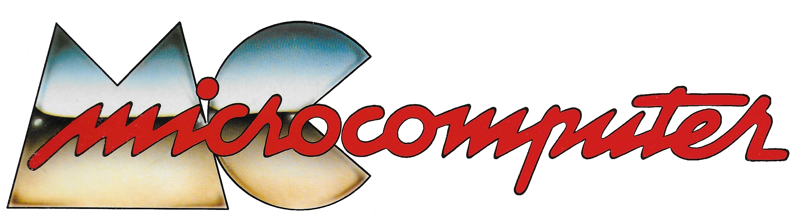

# Programmi pubblicati da MC microcomputer

Per diversi anni, [MC microcomputer](http://www.mc-online.it/) ha pubblicato software di Pubblico Dominio di buona qualità per Vic20, Commodore 64 e Commodore 128. A partire dal numero 57, i listati dei programmi molto lunghi non furono più pubblicati. Rimaneva solo l'acquisto del dischetto presso la redazione o il download da [MC-Link](https://it.wikipedia.org/wiki/MC-link).

Parte dei programmi presenti in questo archivio sono stati scaricati dal sito ftp di MC-Link o erano presenti nel [backup dei dischi](http://www.renatogiussani.it/downloads/commodore-64/Dischi_C64.zip) di [Renato Giussani](http://www.renatogiussani.it/bass-64bass-pc/).

Altri li ho digitati io stesso negli anni '80 e li ho recuperati dai miei floppy. Qualcuno l'ho trovato in giro su internet.

Altri ancora sono stati acquisiti tramite scansione dalle pagine della rivista, passati ad un software OCR, riletti e convertiti in formato Commodore.

## Come convertire tramite OCR

Bisogna fare una scansione a 600dpi dei listati e processarli con un software OCR. La conversione a testo non viene male. Funziona meglio sui listati più recenti, diciamo dall'86 in poi, dove la qualità di stampa era migliore. Però ovviamente non fa miracoli e soprattutto non interpreta i caratteri grafici [petscii](https://www.c64-wiki.com/wiki/PETSCII_Codes_in_Listings) (il mio incubo!).

Come OCR uso [tesseract](https://tesseract-ocr.github.io/) oppure [scan2run](https://github.com/NAMIP-Computer-Museum/scan2run), che ha tanti problemi di giovinezza, ma riesce ad essere efficace dove tesseract ha qualche problema.

A volte li uso entrambi ed evidenzio le differenze con [meld](https://wiki.gnome.org/Apps/Meld). Per la rilettura e la correzione uso [gedit](https://wiki.gnome.org/Apps/Gedit).

Ho anche creato un file di definizione del linguaggio per gtksourceview per avere il [syntax highlighting del Basic 2.0](https://github.com/musuruan/gtksourceview-commodore-syntax). Non è perfetto ma aiuta.

Per convertire da file *.txt al formato commodore *.prg uso petcat, una utility a riga di comando distribuita insieme all'emulatore [vice](https://vice-emu.sourceforge.io/).

Ho realizzato anche [mcsum](https://github.com/musuruan/mcsum), un piccolo script in python che calcola il checksum usato in alcuni listati di MC.

