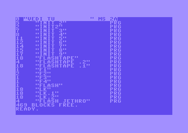
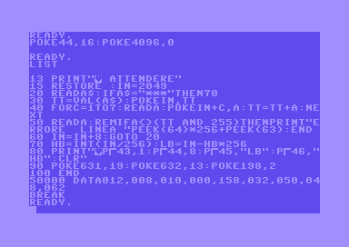
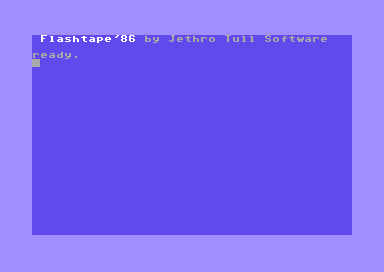
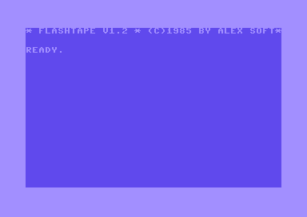

# Flashtape

Dopo aver acquisito tramite OCR e revisionato il listato del Flashtape, mi sono 
accorto che tra i programmi che avevo scaricato da MC link ce n’è uno con un 
nome sospetto ([flastape.bas](./mclink/flastape.bas)).

Se però provo a caricarlo con Vice, sembra contenere solo la directory di un 
floppy. Per questo motivo credo di averlo ignorato negli anni passati.



Noto però che il programma è di 6.5kb. Un po’ troppo per una semplice directory.

Provo quindi a fare un dump esadecimale.

```
$ hexdump -C flastape.bas 
00000000  01 08 1f 08 00 00 12 22  56 45 44 49 20 54 55 20  |......."VEDI TU |
00000010  20 20 20 20 20 20 20 20  22 20 4d 53 20 32 41 00  |        " MS 2A.|
...
00001920  30 31 2c 30 33 32 2c 31  31 35 2c 32 30 32 00 57  |01,032,115,202.W|
00001930  21 24 c7 83 30 30 30 2c  30 33 32 2c 31 30 37 2c  |!$..000,032,107,|
00001940  31 36 39 2c 31 36 35 2c  30 30 31 2c 30 34 31 2c  |169,165,001,041,|
00001950  32 35 33 2c 30 30 30 00  80 21 2e c7 83 31 33 33  |253,000..!...133|
00001960  2c 30 30 31 2c 30 39 36  2c 30 35 36 2c 30 34 34  |,001,096,056,044|
00001970  2c 30 34 38 2c 30 35 34  2c 30 35 30 2c 32 32 36  |,048,054,050,226|
00001980  00 8a 21 38 c7 83 20 2a  2a 2a 00 00 00           |..!8.. ***...|
0000198d
```

Mmmm… Si vedono i DATA e i 3 asterischi che il programma usa per capire di aver 
terminato l’inserimento in memoria.

Rilancio VICE e provo a spostare l’area di inizio BASIC usando i comandi 
presenti su MC: 

`POKE44,16:POKE4096,0`

Tada! Ecco che comparire il listato!



Salvo il tutto ed esporto il programma in un più comodo formato testuale per 
poter fare una comparazione.

Usando ___meld___ noto che:

* ci sono alcune differenze irrilevanti per il funzionamento del programma (i 
	REM a inizio programma sono assenti, alcuni spazi, ecc)
* il controllo del checksum (ultimo byte presente in ogni riga dei DATA) è 
	stato disabilitato
* le uniche linee effettivamente diverse sono quelle comprese tra la 50140 e la 50190


La linea 50140 corrisponde alla locazione di memoria 0x0871 (2049+14*8).

Questo è il contenuto della memoria generato dal programma presente su MC link:

```
(C:$0901) m 0871
>C:0871  c8 d0 f4 93  0e 05 20 c6  4c 41 53 48  54 41 50 45   ...... .LASHTAPE
>C:0881  27 38 36 20  98 42 59 20  ca 45 54 48  52 4f 20 d4   '86 .BY .ETHRO .
>C:0891  55 4c 4c 20  d3 4f 46 54  57 41 52 45  0d 00 00 a9   ULL .OFTWARE....
```

Questo invece quello preso da MC microcomputer:

```
(C:$e5cf) m 0871
>C:0871  c8 d0 f4 93  2a 20 46 4c  41 53 48 54  41 50 45 20   ....* FLASHTAPE 
>C:0881  56 31 2e 32  20 2a 20 28  43 29 31 39  38 35 20 42   V1.2 * (C)1985 B
>C:0891  59 20 41 4c  45 58 20 53  4f 46 54 2a  0d 00 00 a9   Y ALEX SOFT*....
```

Si vede quindi che la differenza tra le due versioni è solo relativa alle 
intestazioni che compaiono allo startup.





Ottimo! Almeno sono sicuro che il programma è stato digitato correttamente.

Purtroppo però il Flashtape su Vice v3.6.1/Linux non funziona correttamente. 
Bisognerebbe provare su un vero C64.