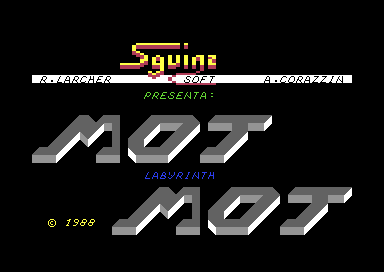
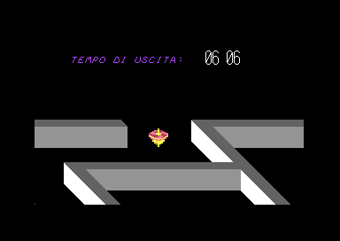

# Mot Mot Labvrinth

Riuscire a trovare l'uscita guardando il labirinto solo 3 volte è quasi un 
miracolo. Tra l'altro viene visualizzata solo la porzione di labirinto in cui
vi trovate.

Se volete guardarlo tutte le volte che volete, durante l'esecuzione
dovete digitare `POKE 7625,234`.

